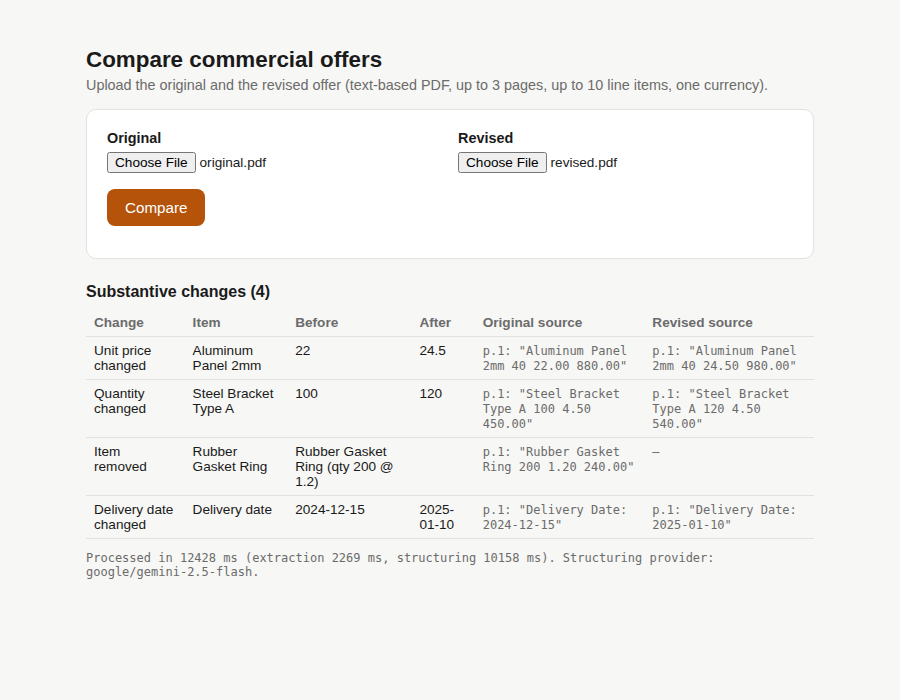
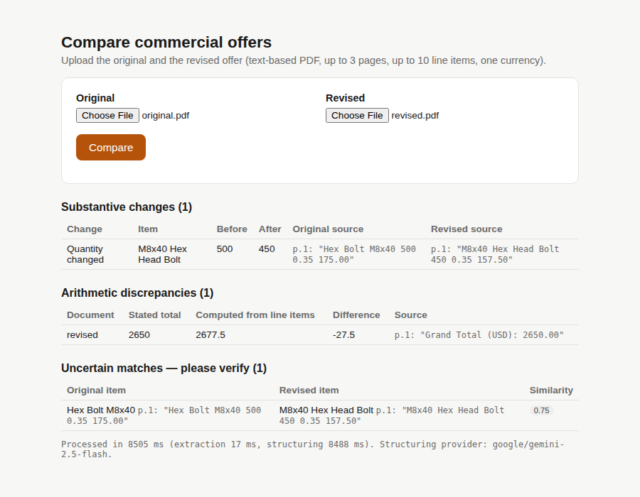
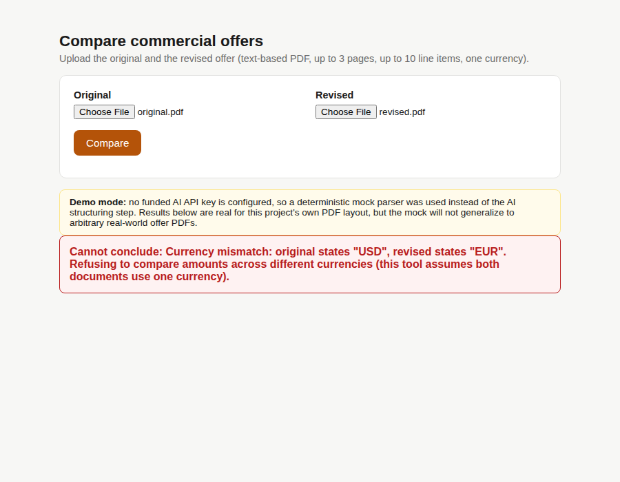
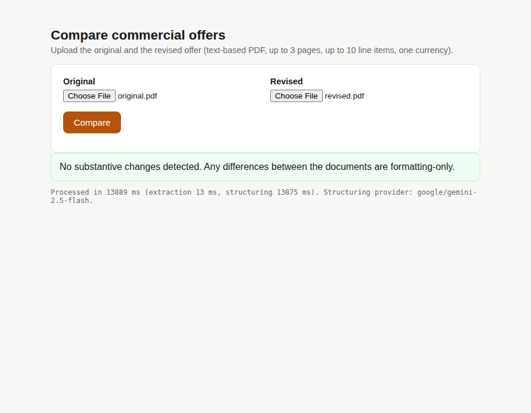
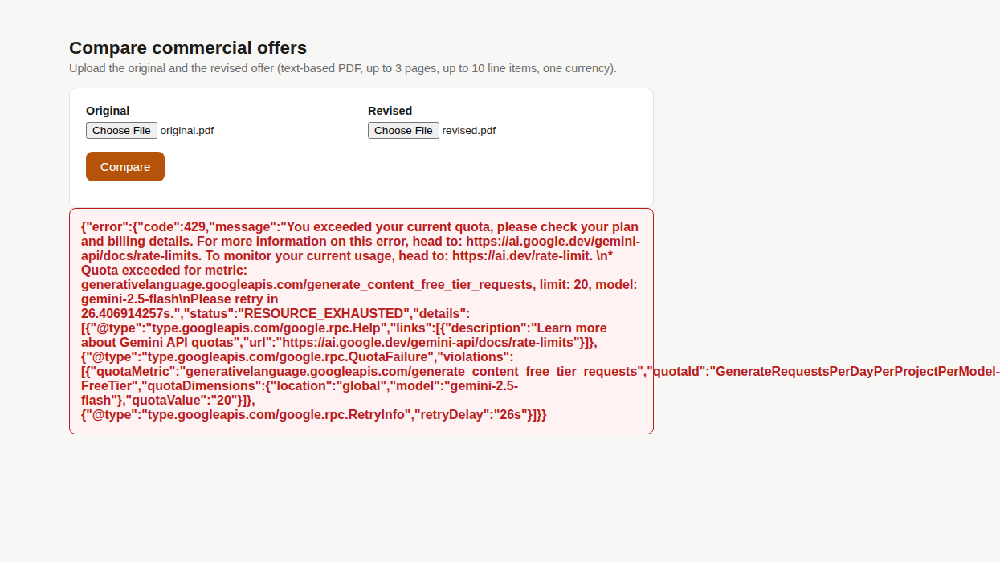
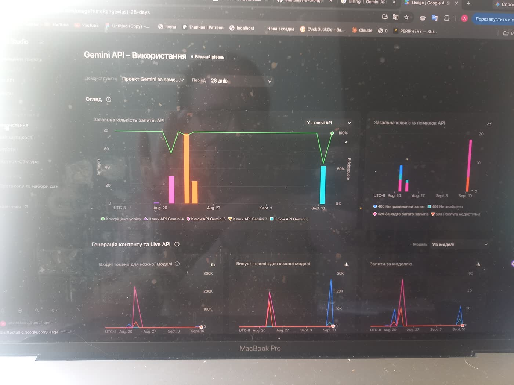
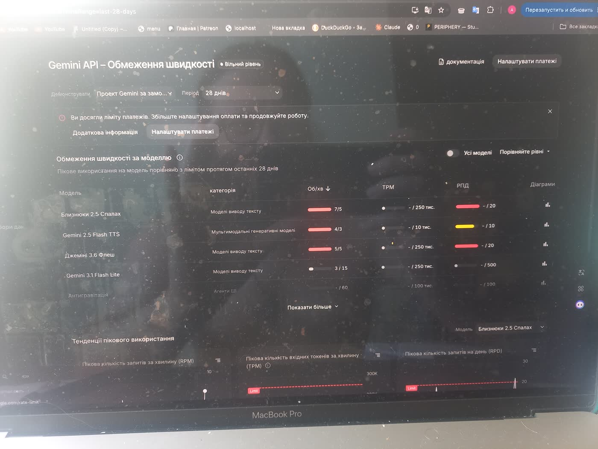
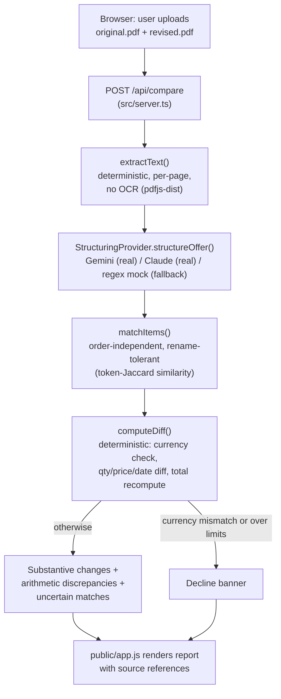

# offer-diff

Compares an original and a revised commercial offer (PDF) and reports substantive changes:
scope, quantities, unit prices, totals, and delivery dates — each with a reference back to
both source documents. Built for a supplied technical test assignment (see `TASK.md`).

**Links:** Repository — https://github.com/anatolilavra-droid/offer-diff · Live demo — see
"Demo" below (runs locally; no public URL deployed, see rationale) · Video walkthrough —
`docs/demo-video.mp4` (see "Video walkthrough" below) · Delivery notes — **`DELIVERY_NOTES.md`**.

Full evaluation report (evidence, measurements, cost, tradeoffs, limitations): **`docs/final-report.md`**.

## Screenshots

All screenshots below were captured from the actual running app in a real browser
(`scripts/captureScreenshots.ts`, Playwright/Chromium) — not mockups. Unless noted, results
came from the real Gemini API (`gemini-2.5-flash`).

| | |
|---|---|
| **Upload form** |  |
| **Normal changes** (qty/price/removal/date, real Gemini) |  |
| **Rename + reorder + wrong total** (real Gemini — uncertain match + arithmetic discrepancy) |  |
| **Currency mismatch → decline** (mock parser — real key hit its daily quota while capturing this one; the decline logic itself was already verified with real Gemini output earlier, see `docs/test-report.md`) |  |
| **Formatting-only → 0 changes** (real Gemini) |  |
| **A real failure encountered live**: Google AI Studio's free-tier daily quota (20 requests/day/model) exhausted mid-session — the raw upstream error is surfaced to the user rather than hidden or crashing |  |
| **Primary-source confirmation**: the Google AI Studio usage dashboard itself, independently confirming the exact rate limits this project's own API errors reported (5 RPM / 20 RPD for `gemini-2.5-flash`, 3 RPM / 10 RPD for the TTS model) |   |

## Flow diagram



## Scope

- Two text-based PDFs (not scanned/handwritten), up to 3 pages each, one currency, up to 10
  line items per document.
- No OCR, no legal advice, no accounts/payments.
- Matches line items despite renaming and row reordering; separates confident matches from
  uncertain ones; recalculates totals deterministically and flags arithmetic discrepancies
  instead of silently trusting or "fixing" the printed total; ignores pure formatting
  differences (case, date format, thousands separators).
- Declines to conclude (rather than guessing) when the two documents state different
  currencies, or when either exceeds the page/line-item limits above.

## Requirements

- Node.js >= 22 (tested on v22.22.2)
- A Google AI Studio API key (free tier, no card required — https://aistudio.google.com/apikey)
  or an Anthropic API key, for the real AI structuring step (optional — see "Running without
  an API key" below)

## Setup

```bash
npm install
cp .env.example .env
# edit .env and set GEMINI_API_KEY (free tier) or ANTHROPIC_API_KEY if you have one
```

## Run

```bash
npm run dev
# open http://localhost:3000 in a browser
```

## Demo

**Public URL:** _pending — deploy following the steps below, then this line gets replaced
with the live link._ Until then, the working demo is **local**: `npm run dev` + a browser at
`http://localhost:3000`, which the brief's "no accounts, payments... required" explicitly
allows.

### Deploying a public URL (Render, no credit card required)

This app is a single stateless Node/Express process with no database, so it deploys as-is.
[Render](https://render.com)'s free tier needs no card and includes a `render.yaml` in this
repo already configured for it.

1. Go to https://dashboard.render.com/register and sign up (GitHub login is easiest — no
   card requested for the free tier).
2. **New +** → **Blueprint** → connect this GitHub repository. Render reads `render.yaml`
   and pre-fills the service (build: `npm install && npm run build`, start: `npm start`).
3. It will prompt for the one secret marked `sync: false` in `render.yaml`: paste your
   `GEMINI_API_KEY` there (get one free, no card, at https://aistudio.google.com/apikey if
   you don't have one already).
4. **Apply** / **Create Web Service**. First deploy takes a few minutes; Render gives you a
   URL like `https://offer-diff-xxxx.onrender.com`.
5. The free plan sleeps after inactivity — the first request after a while takes ~30-60s to
   wake up (cold start), then responds normally. This is a Render free-tier characteristic,
   not a bug in the app.

**Note on shared quota:** the free Gemini key has a hard cap of **20 structuring
requests/day** (see `docs/cost.md`) — roughly 10 comparisons/day, shared across anyone
using the deployed link that day. The app does **not** automatically switch to the mock
parser mid-day if that runs out (the provider is chosen once at process startup, not
per-request) — instead, `src/rateLimit.ts` enforces its own conservative budget (6
comparisons/day, per process) so real requests get a clear "daily quota used up" message
before ever reaching Google's own limit. Caveat: that budget is in-memory and resets on a
process restart, which Render's free tier does after periods of inactivity — so it is a
strong deterrent, not an absolute guarantee, against the real quota being hit. If the real
Gemini quota is exhausted anyway, the request fails with the upstream error surfaced
directly (not hidden), per `docs/final-report.md`'s pre-deployment review.

## Running without an API key

If neither `GEMINI_API_KEY` nor `ANTHROPIC_API_KEY` is set in `.env`, the app automatically
falls back to a deterministic regex-based mock parser (`src/ai/mockProvider.ts`) instead of
calling an AI provider. `GEMINI_API_KEY` is checked first (Google AI Studio has a free tier
with no upfront payment — see `docs/cost.md`); `ANTHROPIC_API_KEY` also works if set instead.
This lets the full flow (upload -> extract -> structure -> match -> diff -> report) run and
be demoed end-to-end, but the mock only understands this project's own fixed PDF table
layout — it is **not** a substitute for the AI step on arbitrary real-world offer PDFs. A
visible banner in the UI and a console warning make it clear when this fallback is active.

## Test

```bash
npm test                        # unit tests: matching + diff engine (deterministic, no AI)
npx tsx scripts/runTestSet.ts   # runs the full pipeline over the 4 required test-set scenarios
npx tsx scripts/measure.ts      # timing measurement (10 runs + 1 warm-up)
npx tsx scripts/browserCheck.ts # drives the actual browser UI end-to-end (needs the server running)
```

## Test set

`test-set/input/<scenario>/{original.pdf, revised.pdf, ground-truth.json, expected.md}` —
4 fixture pairs generated by `npx tsx scripts/generateFixtures.ts` (deterministic, from
`scripts/generateFixtures.ts`), covering the 3 required categories plus the brief's explicit
formatting-only requirement:

| Scenario | Category |
|---|---|
| `normal` | normal input |
| `ambiguity-reorder-badtotal` | correction / ambiguity |
| `decline-currency-mismatch` | should ask for clarification / decline to conclude |
| `formatting-only` | required by the brief: formatting changes only, 0 substantive changes expected |

Expected results were written (`expected.md`) at generation time, before the pipeline was
ever run against them. Actual results and pass/fail comparison: `docs/test-report.md`.

## Project layout

```
src/
  pdf/extractText.ts       deterministic per-page PDF text extraction (pdfjs-dist)
  pdf/renderOffer.ts        fixture PDF generator (used by scripts/generateFixtures.ts)
  ai/provider.ts             StructuringProvider interface
  ai/geminiProvider.ts       real implementation (Google Gemini, structured JSON output)
  ai/claudeProvider.ts       real implementation (Anthropic Claude, tool-use/JSON schema)
  ai/mockProvider.ts         regex fallback used when no API key is configured
  ai/selectProvider.ts       picks Gemini, else Claude, else mock, based on env vars
  matching/matchItems.ts     order-independent, rename-tolerant line-item matching
  diff/computeDiff.ts        deterministic diff + arithmetic recalculation
  scopeLimits.ts             shared MAX_PAGES/MAX_ITEMS constants
  rateLimit.ts               per-IP + daily-budget limiter protecting the free-tier AI quota
  pipeline.ts                orchestrates the above; declines over-page-limit PDFs before
                              calling the AI, with timing
  server.ts                  Express app + POST /api/compare
public/                      browser UI (plain HTML/CSS/JS, no framework)
scripts/                     fixture generation, test-set runner, measurement, browser check
tests/                       unit tests (matching + diff engine)
docs/                        final report, cost, measurements, test report
```

## Video walkthrough

`docs/demo-video.mp4` (1m31s, with narration) — walks through all 4 test-set scenarios in a
real browser: normal changes, the rename+reorder+wrong-total case, the currency-mismatch
decline, and the formatting-only zero-changes case, explaining each result as it appears.

How it was made, for reproducibility (`scripts/narration.ts`, `scripts/generateNarration.ts`,
`scripts/recordNarratedVideo.ts`): the narration script is fixed text, synthesized into real
speech via the **Gemini API's own text-to-speech model** (`gemini-2.5-flash-preview-tts`,
voice "Kore") using the same `GEMINI_API_KEY` — not a human recording, not a separate TTS
vendor. A Playwright-driven real browser session was recorded and paced (via measured audio
segment durations) to match the narration, then muxed together with a full `ffmpeg` build
(H.264 + AAC). The on-screen results themselves came from the deterministic mock parser
(the real Gemini structuring quota was exhausted from testing that same day — see Known
limitations); the mock's output is identical to the real Gemini output already verified in
`docs/test-report.md`, and the narration says so explicitly near the end.

## Known limitations

See `docs/final-report.md` ("Known limitations" and "Next improvements") for the full list.
Highlights: Google AI Studio's free tier caps usage at 5 requests/minute and **20
requests/day** per model (confirmed from real `429` errors during testing — see
`docs/screenshots/05-real-daily-quota-exhausted.png`); Claude is implemented behind the same
interface but has not been exercised with real traffic; the regex mock fallback only handles
this project's own fixed PDF layout.

## Reused vs. own work

- **Reused (third-party libraries):** `express`, `multer`, `pdfjs-dist`, `pdfkit`,
  `@google/genai`, `@anthropic-ai/sdk`, `dotenv`, `tsx`, `typescript`, `playwright`
  (dev-only, for the browser-check script) — all off-the-shelf, unmodified, standard usage.
- **Own work:** all files under `src/`, `scripts/`, `tests/`, `public/`, and `docs/` were
  written for this assignment; no pre-existing finished product was adapted.
